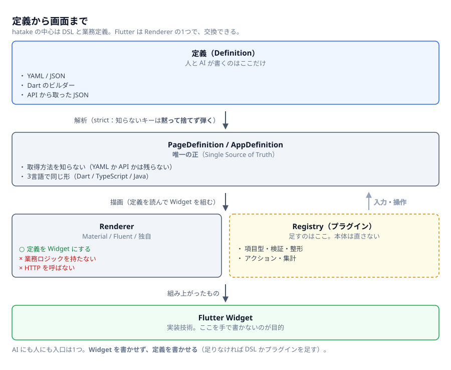
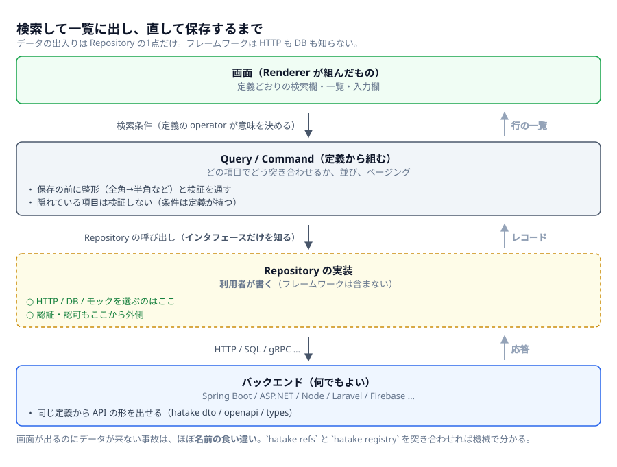
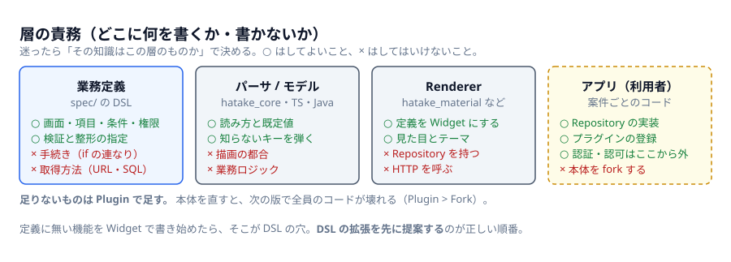
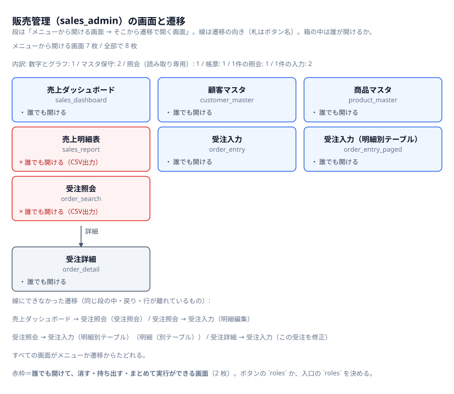
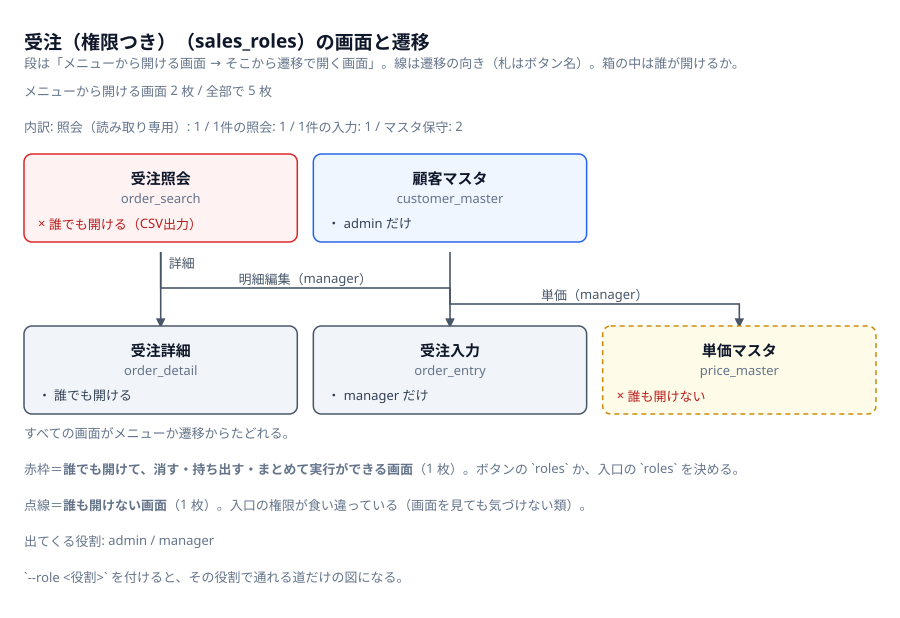
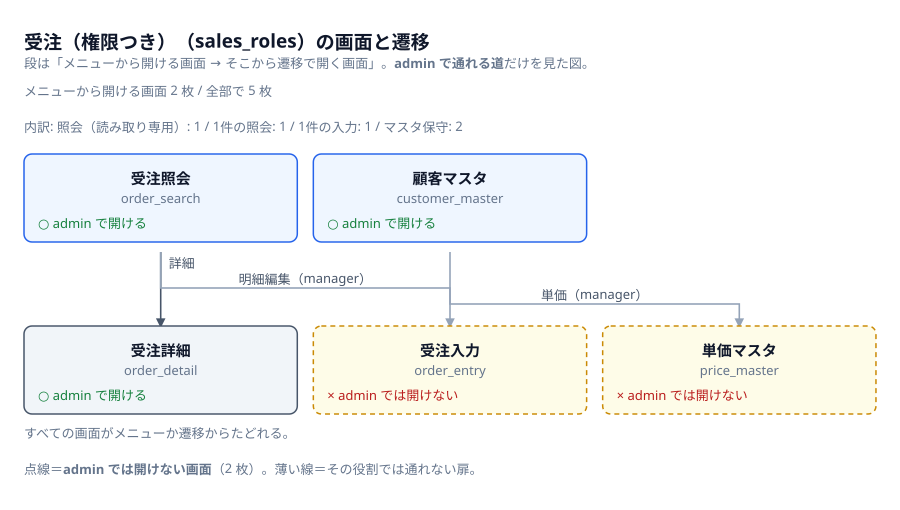

# 図解

文章で読むのがしんどい所だけ絵にした3枚。**この絵は生成物**で、元は隣の `*.json`。
直したら作り直す（CI が作り直して差分を見るので、絵だけ古いという状態にはならない）。

```bash
for f in docs/diagrams/*.json; do
  node typescript/dist/cli.js diagram "$f" --out "${f%.json}.svg"
done
```

描いているのは CLI（`hatake diagram`）で、**定義から作る図と同じ描画**を使う
（[`typescript/src/diagram.ts`](../../typescript/src/diagram.ts)）。資料用と道具用で
描画を2本持つと、必ず片方が古くなる。

サイトでも同じ絵を出している → <https://asil-e-hatake.github.io/hatake/diagrams>

## 1. 定義から画面まで



読みどころは3つ。

* **人と AI が書くのは定義だけ。** Widget を書き始めたら、それは DSL の穴（拡張の提案が先）
* **`PageDefinition` が唯一の正。** YAML から来たか API から来たかは、ここには残らない
* **Renderer は業務を知らない。** 業務ロジックも HTTP も持たない。足すものは Registry へ

→ 責務の話は [仕組みと責務分担](../guide/concepts.ja.md)、DSL は [仕様](../../spec/dsl-spec.ja.md)。

## 2. 検索して一覧に出し、直して保存するまで



**データの出入りは Repository の1点だけ。** フレームワークは HTTP も SQL も知らないので、
バックエンドは何でもよく、テストではモックに差し替えるだけで済む。

画面は出るのにデータが来ない、という事故はほぼ**名前の食い違い**（`orderRepository` と
`orderRepo`）。これは目で見ても気づけないので機械に言わせる:

```bash
npx hatake refs page.yaml --needs-registration      # 定義が要求しているもの
npx hatake registry lib/main.dart --out hatake-registry.json  # アプリが登録しているもの
npx hatake validate page.yaml --registry hatake-registry.json # 突き合わせる
```

## 3. 層の責務（どこに何を書くか）



迷ったら「その知識はこの層のものか」で決める。**足りないものは Plugin で足す**
（本体を直すと、次の版で全員のコードが壊れる）。

→ 判断に迷う所は [ページ種別の選び方](../guide/page-types.ja.md) と
[よくある間違い](../../spec/pitfalls.json)（`npx hatake pitfalls <キー名>`）。

## 4. 定義から作った遷移図



手で書く元データの他に、**実際の定義から**図を作れる。上の絵は同梱の例
（[`spec/examples/sales_app.yaml`](../../spec/examples/sales_app.yaml)）から作ったもので、これも
生成物（CI が作り直して差分を見る）。

```bash
npx hatake diagram spec/examples/sales_app.yaml --out docs/diagrams/sales-app-flow.svg
npx hatake diagram app.yaml --json           # 元データだけ（手で直してから描ける）
```

段は「メニューから開ける画面 → そこから `navigate` で開く画面 → …」。**どこからも開けない
画面**（メニューにも遷移先にも無い）はこの並べ方で自然に落ちてくるので、そこだけ別に出す。
1枚の画面の中身は図にしない（`hatake explain` のほうが読める）。

段のあいだの遷移は**1本ずつ線**にする。線を引けるのは隣り合う行のあいだだけなので、段の中では
次の段へ進む画面を後ろに置く。それでも引けない遷移（同じ段の中・戻り・行が離れている）は
**絵の下に文で全部挙げる**＝図に出ていない遷移を黙って落とさない。

## 5. 権限を重ねた図



元は [`roles-app.yaml`](roles-app.yaml)（この絵のために置いてある小さなアプリ）。**ページに
`roles` は書けない**ので、「この画面は誰に見えるか」はメニューとボタンの `roles` から**辿って**
数える。読みどころは、1枚ずつ読んでも出てこない2つ。

* **赤枠**＝誰でも開けて、消す・持ち出すができる画面。1枚だけ見ると「`roles` の無い CSV出力」に
  見えるが、まずいのは**そこへ誰でも来られる**とき
* **点線**＝**誰も開けない画面**。admin だけの顧客マスタから manager だけのボタンで繋いだので、
  両方持っている人が居ない。定義としては通るし、画面を見ても気づけない

役割を1つ選ぶと「**その役割で通れる道**」の図になる（通れない扉は薄い線で残す）。



```bash
npx hatake diagram docs/diagrams/roles-app.yaml --out docs/diagrams/roles-app-flow.svg
npx hatake diagram docs/diagrams/roles-app.yaml --role admin   --out docs/diagrams/roles-app-admin.svg
```

## 絵を直す・足す

1枚 = `docs/diagrams/<名前>.json`。書けるのは縦積みだけで、行は3種類。

| 行 | 中身 |
| --- | --- |
| `boxes` | 横に並べる箱（`label` / `note` / `lines` / `tone` / 線を引くなら `id`）。`lines` の先頭が `+` なら○、`!` なら×。`slots` を渡すと、その数で割った幅に左詰めで置く（段が複数行に分かれても箱の幅が揃う） |
| `arrow` | 下向きの矢印。`label` が行き、`back` があれば右に戻りの矢印も描く |
| `links` | 直前の行の箱と直後の行の箱を、**1本ずつ**繋ぐ線（`from` / `to` / `label` / `back`）。箱に `id` を付けておく。向きは上下どちらの行に居るかで決まる |
| `note` | 幅いっぱいの注記（絵の下に添える1行） |

`tone` は `input`（外から入るもの）/ `core`（フレームワーク）/ `output`（出来上がるもの）/
`outside`（利用者が用意するもの）。`**…**` で強調できる。

**文字幅は測らずに数えている**ので、枠から溢れる文を書くと生成器がそこで落ちる
（溢れたことに気づかないまま配るのが一番まずいので、警告ではなくエラー）。落ちたら文を
短くするか、`lines` を分ける。
