# VS Code 拡張（AI が書いた定義を、人が見て判断する）

> **中身**: hatake の VS Code 拡張機能の入れ方・使い方・注意点。
> **読むとき**: AI に定義を書かせたあと、人がそれを確かめるとき。

hatake の定義は AI が書きます（[MCP](mcp.ja.md)）。拡張機能は、**AI が書いたものを人が見て
判断するための道具**です。人が YAML を手で書くための道具ではありません。

**YAML を読まなくても確かめられる**ようにしてあります。左の hatake の欄に、案件の定義が
業務の言葉（画面名・項目のラベル）で並びます。選ぶと、エディタ領域にその画面がタブ付きで
開きます。

| タブ | 何が見えるか |
|---|---|
| [画面](#画面) | **動く画面**（作り物のデータ）。役割を切り替えて、誰に何が見えるかも |
| [項目](#項目) | 入力欄・一覧の列・検索条件を表で（ラベル・種類・決めごと・選択肢・見える人） |
| [操作](#操作) | ボタンごとに、何をする・確認するか・押せる人 |
| [権限](#権限) | 役割ごとに、見える・押せるの表 |
| [確認](#確認ai-と同じ紙) | AI が MCP で見ているのと**同じ紙**（事実・人が決めること・好み・読み返し） |

中身は全部、拡張機能の中で直に呼ぶ道具の答えです（MCP と同じ道具の束）。**AI が見ている答えと、
人がここで見る答えは同じ**です。0.9.31 でできるのは「見る」ことだけで、定義は書き換えません。

YAML を開いて確かめたい人（開発者や、AI と一緒に直す人）向けには、[YAML の横で見る](#yaml-の横で見る)
道具もあります。

## 入れ方

[Release](https://github.com/ASIL-E-Hatake/hatake/releases) に貼ってある
`hatake-vscode-<版>.vsix` を落として:

```bash
code --install-extension hatake-vscode-0.9.31.vsix
```

VS Code の画面からなら、拡張機能の一覧の「…」→「VSIX からのインストール…」でも入ります。
Marketplace には出していません。版は枠組みと同じ番号です（**案件が固定している版と同じものを
入れてください**＝[版のずれ](#版のずれ)）。

## ツリーから見る

左端の hatake のアイコン（畠と芽）を押すと、2つの欄が出ます。

- **定義**: 作業場の定義（`page:` か `app:` で始まる YAML）を、ファイルごとに並べます。
  app ならメニューと画面、画面の下には検索条件・一覧の列・入力欄・操作が件数つきで並びます。
  画面の横の `？5 ⓘ2` は、[確認](#確認ai-と同じ紙)のタブの数です
- **人が決めること**: 全部の定義から集めた問いを、画面ごとに並べます。人がまず目を通す所です

保存すると読み直します（欄の右上の ⟳ でも読み直せます）。

### 画面

画面を選ぶと、エディタ領域にその画面が開きます（最初は「画面」のタブ）。

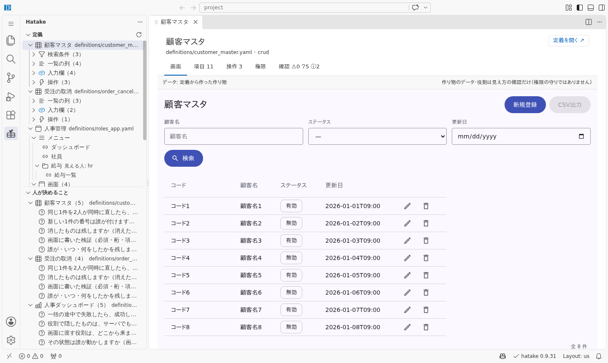

- 描いているのは Vue 版の Renderer そのものです（見本の30分サンプルと同じもの）。
  ボタンを押す・検索する・新規登録の入力欄を開く、まで実際に動きます
- データは**定義から作った作り物**です（[データ](#データ)）
- 右上の「定義を開く ↗」で、YAML のその画面の所に飛びます

app の名前（いちばん上の行）を選ぶと、app ぜんぶ（メニューつき）が開きます。役割の切り替えで、
その役割の人に見えるメニュー・列・ボタンだけで描き直します。

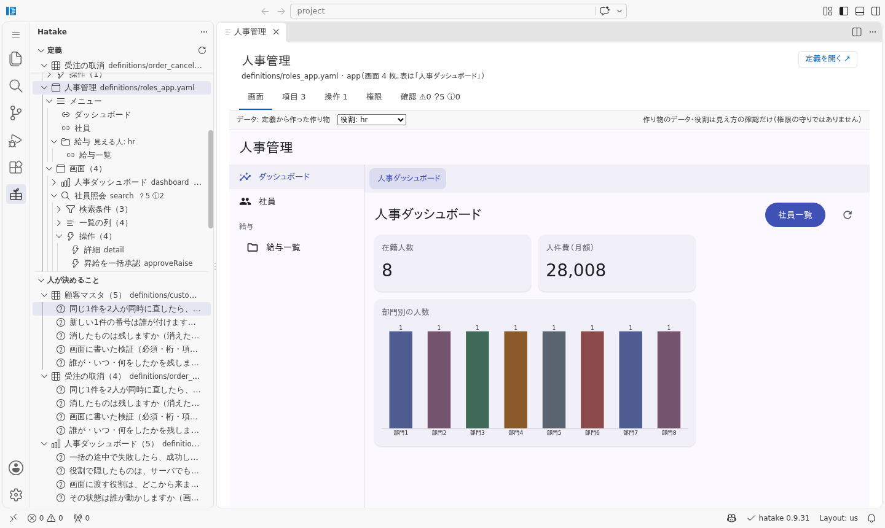

> ⚠️ **見え方の確認だけです。** `roles` は画面に出すかどうかを決めるだけで、本当の遮断は
> サーバの仕事です（[権限](concepts.ja.md)）。プレビューで見えないことは、守られていることの
> 証拠になりません。

### 項目

ツリーで入力欄や列を選ぶと、「項目」のタブが開いて、その行が光ります。

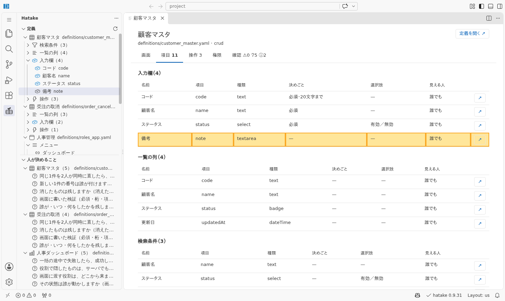

| 列 | 中身 |
|---|---|
| 決めごと | 必須・文字数・数の範囲・形式・読むだけ・条件で出る… を短い言葉で |
| 選択肢 | その場に書いたものも、語彙（`optionsOf`）で指したものも、ラベルで |
| 見える人 | `roles` を書いていなければ「誰でも」 |
| ↗ | 定義のその行を開く |

### 操作

ツリーでボタンを選ぶと、「操作」のタブが開いて、その行が光ります。

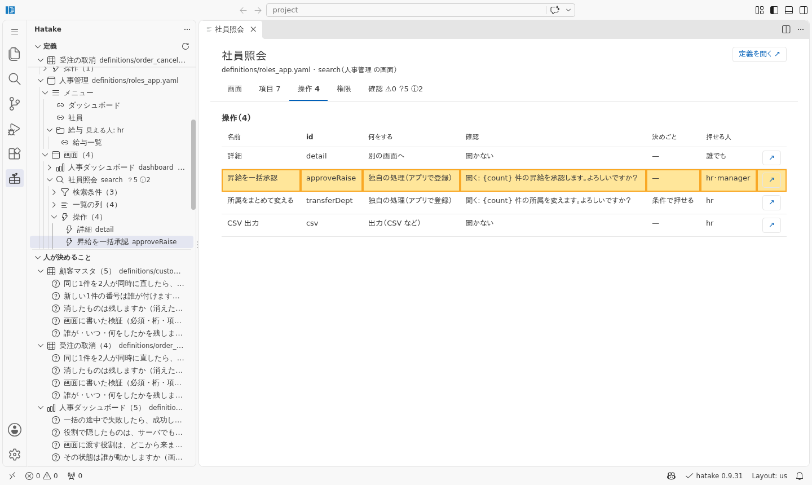

何をするか（新規登録・削除・出力・別の画面へ…）・確認するか・押せる条件・押せる人が並びます。
削除は、確認を書いていなくても**必ず聞きます**（枠組みの決めごと）。表にもそう出ます。

### 権限

役割ごとに、どの列・項目・ボタンが見える（押せる）かの表です。

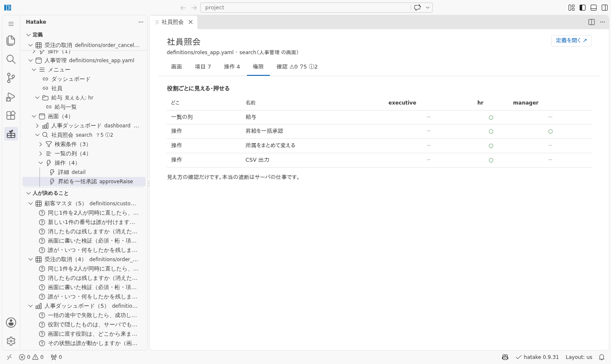

役割は定義に出てくる名前です（`roles` に書いたもの）。役割を書いていない所は表に出ません
（誰にでも見えるので）。

### 確認（AI と同じ紙）

AI が MCP で受け取るのと同じ紙（`hatake_check`）を、欄ごとのカードで出します。
「人が決めること」の欄で問いを選ぶと、ここが開いてその問いが光ります。

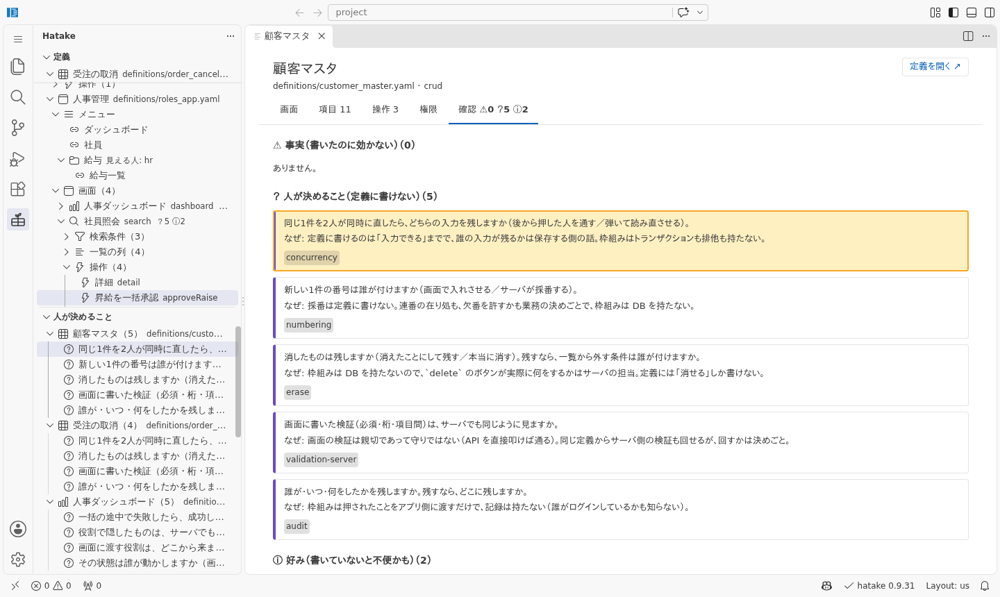

| 欄 | 意味 | 誰が直すか |
|---|---|---|
| ⚠ 事実（書いたのに効かない） | 書いてあるのに画面では効いていない | 直す（AI に `hatake_fix` で） |
| ？ 人が決めること（定義に書けない） | 決まっていないと、画面が在るのに嘘になること | **人**（AI に決めさせない） |
| ⓘ 好み（書いていないと不便かも） | 書いていないから不便かもしれない所 | 業務の判断（直さなくてもよい） |
| 読み返し | この定義がどういう画面か（`hatake_explain` と同じ文） | 頼んだことと違っていないかを見る |

「人が決めること」の答えは、案件の前書き（`hatake.project.yaml`）の `logic` に書きます
（[案件の前書き](project.ja.md)）。書けば次から出なくなります。

### 最初に開くタブ

ツリーで画面を選んだときに最初に開くタブは、設定で変えられます（既定は「画面」）。
項目や操作を選んだときは、設定に関係なくその表のタブが開きます。

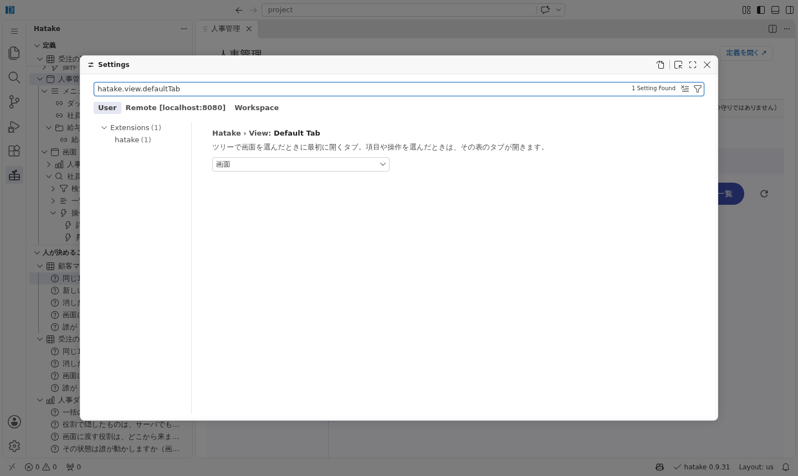

設定の画面で `hatake.view.defaultTab` を探すか、`settings.json` に:

```json
{ "hatake.view.defaultTab": "fields" }
```

（`screen`＝画面・`fields`＝項目・`actions`＝操作・`roles`＝権限・`check`＝確認）

## YAML の横で見る

YAML を開いて確かめたい人向けの道具です。

### プレビュー

定義を開いて、エディタの右上のボタンか、コマンド「**hatake: プレビューを開く（YAML の横）**」。
「画面」のタブと同じ部品で、YAML の横に出ます。保存するたびに描き直します。

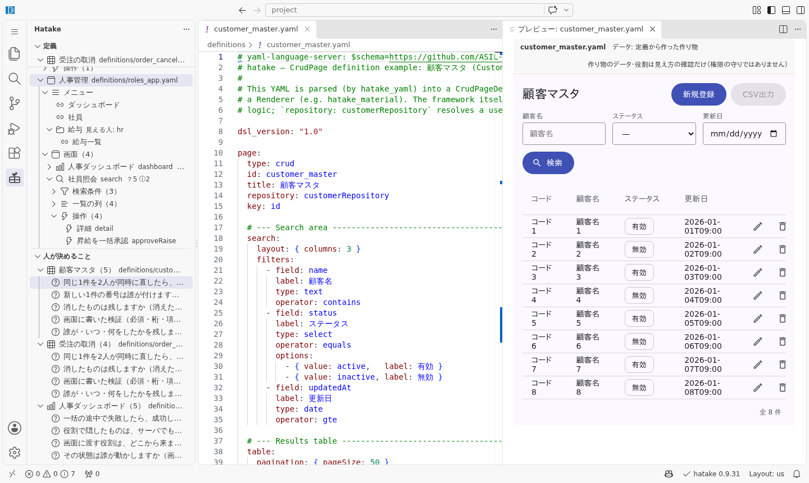

読めない定義は、白い画面にせず**理由**を出します。

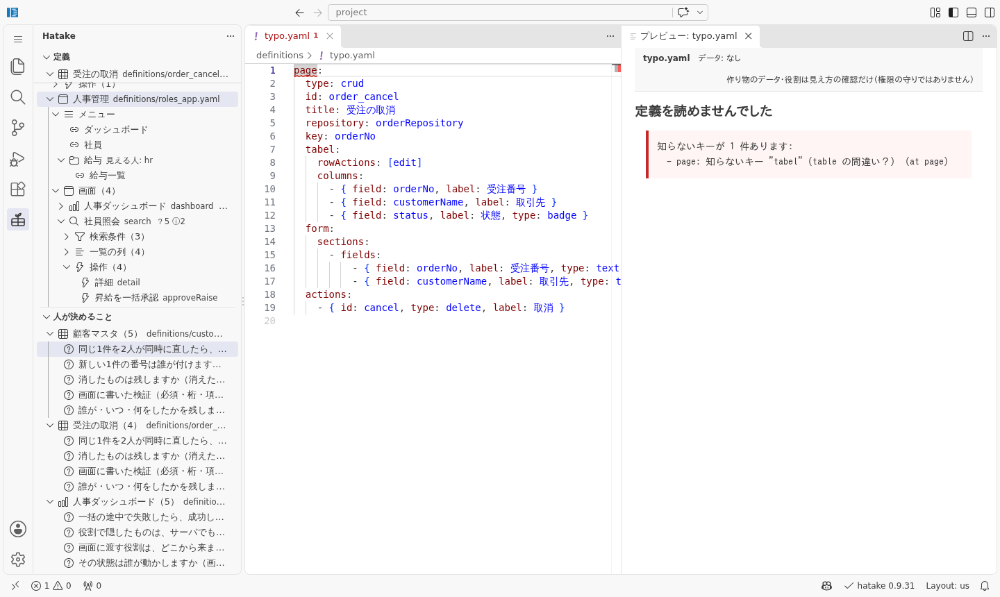

### 問題の一覧

定義を開いたとき・直したとき・保存したときに `hatake_check` を回して、VS Code の「問題」に
出します（確認のタブと同じ紙）。行をクリックすると、定義のその場所に飛びます。

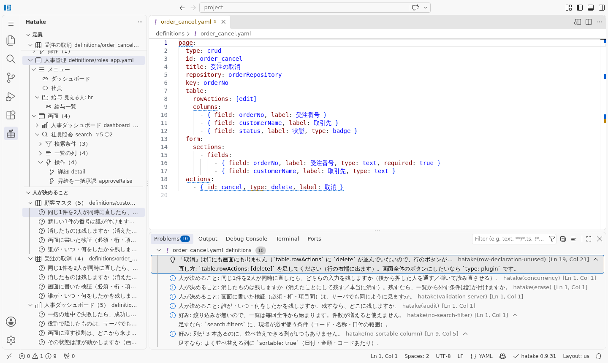

事実は ⚠ 警告、好みと人が決めることは ⓘ 情報で、文の頭に「好み:」「人が決めること:」が付きます。

### キーの説明（ホバー）

キー（や値）にカーソルを当てると、型・既定値・取れる値・書ける場所が出ます
（`hatake_reference` と同じ答え。`maxLength` のような**値**でも引けます）。

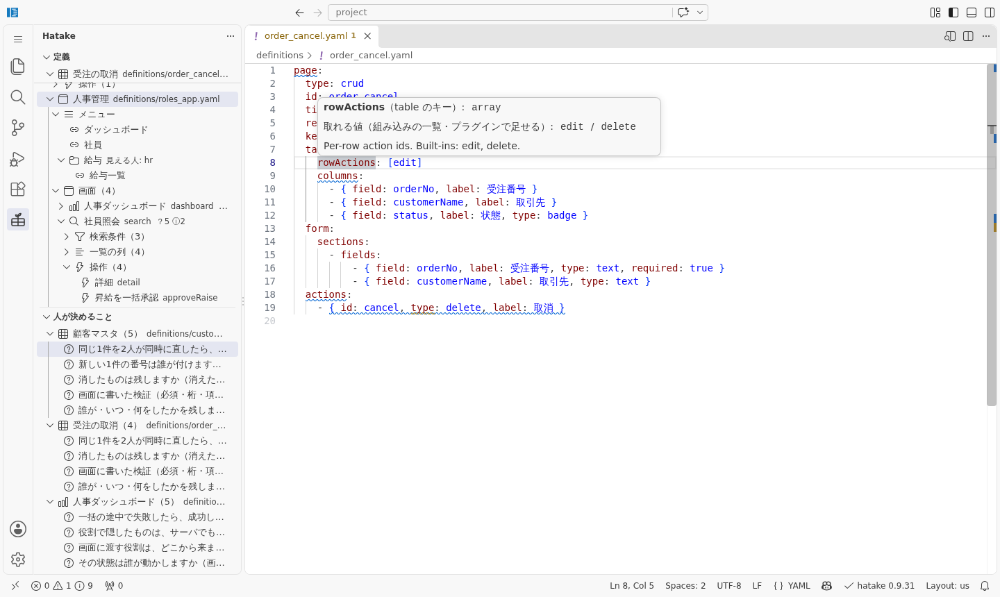

### 読み返し

コマンド「**hatake: 読み返しを開く**」で、定義が何をする画面かを日本語で横に出します
（`hatake_explain` と同じ文）。読むだけの文書なので、閉じても保存は聞かれません。

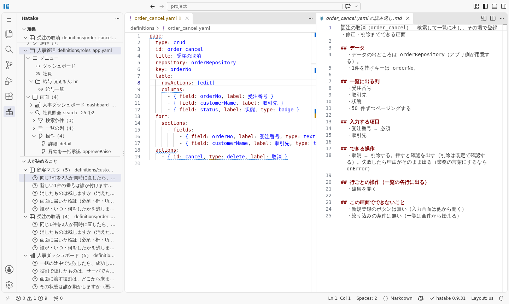

### スニペットとスキーマ

- **スニペット**: `hatake-crud`・`hatake-search` などと打つと、画面の雛形が出ます
  （`hatake new` と同じもの。8 種）
- **スキーマの紐付け**: `definitions/**/*.yaml`・`*.hatake.yaml`・`hatake.project.yaml`・
  `*.intent.yaml` に、hatake のスキーマを自動で当てます（補完と検証には Red Hat の YAML 拡張
  `redhat.vscode-yaml` が要ります。先頭に `# yaml-language-server: $schema=…` が書いてあれば
  そちらが勝ちます）

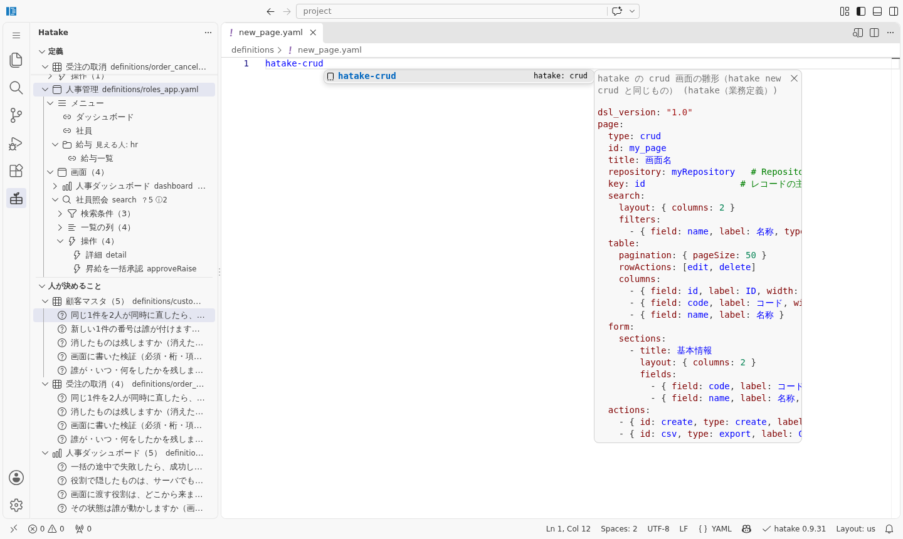

## データ

画面に入れるデータは**定義から作った作り物**です（本物のサーバは見ません）。

- その Repository を使う画面の列・入力欄・絞り込みの項目から、8 行作ります
- 値は定義の制約から作ります（選択肢は順に回す・数と日付はずらす・1件を指す項目は重ならない）。
  作り方は `hatake run --draft` や `hatake fixtures` と同じ所です
- 本物らしいデータで見たいときは、定義の横に `preview/<Repository 名>.json`（行の配列）を
  置いてください。在ればそちらを使い、帯に `データ: preview/<名前>.json` と出ます

```json
[
  { "customerCode": "C001", "customerName": "株式会社あおぞら商事", "kind": "corporate" },
  { "customerCode": "C002", "customerName": "南商店", "kind": "personal" }
]
```

> ⚠️ **独自の処理（`type: plugin` のボタン・独自の検証・計算）は登録されていません。**
> 画面は定義だけで描くので、アプリ側で登録するものは「未登録」として押せない形で出ます
> （画像の「CSV出力」が灰色なのもこれ）。動かないのは定義の誤りではありません（登録が要るものは
> `hatake refs` で引けます）。

## 版のずれ

状態バーの右下に版が出ます。拡張機能の版と、案件が固定している版（`hatake.version`・
package.json・pubspec など）が違えば、黄色で両方の版を出します。


拡張機能は枠組みを同梱しているので、**タブや問題の一覧の中身は拡張機能の版の答え**です。
版が違うと、案件で使っている版では言われないこと（あるいは言われるはずのこと）が出ます。
案件の版に合わせた `.vsix` を入れてください。物差しは `hatake doctor` と同じです。

## 注意点（まとめ）

- **画面のデータは作り物**です。本物のサーバ・本物のデータとは違います
- **役割の切り替え・権限の表は見え方の確認だけ**です。権限の守りではありません
- **登録が要る処理は動きません**（「未登録」として押せない形で出る）
- **補完と検証には Red Hat の YAML 拡張が要ります**（ツリー・タブ・問題の一覧は無くても動く）
- **0.9.31 では定義を書き換えません**。直すのは AI か人です（「直す」「当てる」ボタンは次の版から）
- 拡張機能は**案件の版と同じもの**を入れてください（違えば状態バーが黄色になります）

## この手引きの画像

画像は手で撮っていません。code-server（ブラウザで動く VS Code）に拡張機能を入れ、
puppeteer で操作して撮っています（撮れた中身も 18 項目確かめています）。版を上げたら撮り直します:

```bash
node vscode/tool/package.mjs
```

```bash
bash vscode/tool/shots.sh
```
