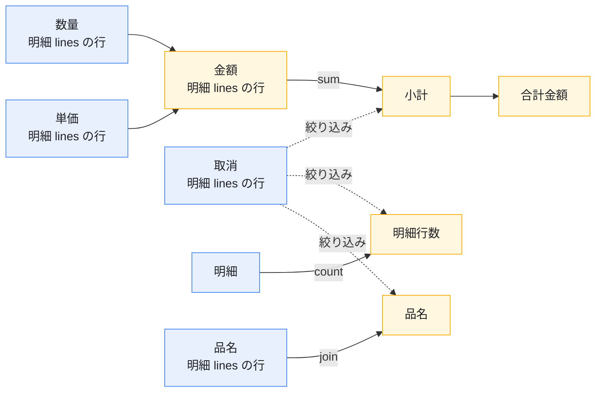

# 図解

文章で読むのがしんどい所だけ、3枚にした。**絵は生成物**（元は
[`docs/diagrams/*.json`](https://github.com/ASIL-E-Hatake/hatake/tree/main/docs/diagrams)）で、
CI が作り直して差分を見ているので「言葉を直したのに絵が古い」が起きない。

## 定義から画面まで


読みどころは3つ。

- **人と AI が書くのは定義だけ。** Widget を書き始めたら、それは DSL の穴（先に拡張を考える）
- **`PageDefinition` が唯一の正。** YAML から来たか API から来たかは、ここには残らない
- **Renderer は業務を知らない。** 業務ロジックも HTTP も持たない。足すものは Registry へ

## 検索して一覧に出し、直して保存するまで


**データの出入りは Repository の1点だけ。** フレームワークは HTTP も SQL も知らないので、
バックエンドは何でもよく、テストではモックに差し替えるだけで済む。

画面は出るのにデータが来ない、という事故はほぼ**名前の食い違い**（`orderRepository` と
`orderRepo`）。目で見ても気づけないので機械に言わせる。

```bash
npx hatake refs page.yaml --needs-registration      # 定義が要求しているもの
npx hatake registry lib/main.dart --out hatake-registry.json  # アプリが登録しているもの
npx hatake validate page.yaml --registry hatake-registry.json # 突き合わせる
```

## 層の責務（どこに何を書くか）


迷ったら「その知識はこの層のものか」で決める。**足りないものは Plugin で足す**
（本体を直すと、次の版で全員のコードが壊れる）。

## 定義から作った遷移図

同じ描画で、**実際の定義から**「画面とメニューと遷移」の図も作れる。下は同梱の例
（`spec/examples/sales_app.yaml`）から作ったもので、この絵も CI が作り直して差分を見ている。


```bash
npx hatake diagram app.yaml --out app.svg
```

段は「メニューから開ける画面 → そこから遷移で開く画面 → …」。この並べ方にすると**どこからも開けない画面**（メニューにも遷移先にも無い）が自然に落ちてくる。画面が増えたときに一覧では気づけないやつが、図だと目に入る。

段のあいだの遷移は**1本ずつ線**になる。まとめて1本の矢印にすると「AとBのどちらから開くのか」が読めないため。線を引けるのは隣り合う行のあいだだけなので、段の中では次の段へ進む画面を後ろに置く。それでも引けない遷移（同じ段の中・戻り）は**絵の下に文で全部挙げる** — 線が無い＝遷移が無い、と読まれるのが一番まずいので。

## 権限を重ねた図

**ページに `roles` は書けない。** 権限が書けるのはメニュー項目とボタン（と列・項目・カード）なので、「この画面は誰に見えるか」は入口から辿るしかない。図はそれを数えて箱の中に書く。


読みどころは、1枚ずつ読んでも出てこない2つ。

- **赤枠**＝誰でも開けて、消す・持ち出すができる画面。1枚だけ見ると「`roles` の無い CSV出力」に見えるが、まずいのは**そこへ誰でも来られる**とき
- **点線**＝**誰も開けない画面**。admin だけの画面に manager だけのボタンで繋ぐと、両方持っている人が居ない。定義としては通るし、画面を見ても気づけない

役割を1つ選ぶと「**その役割で通れる道**」の図になる。通れない扉は薄い線で残す（扉が在ること自体は消さない）。


```bash
npx hatake diagram app.yaml --role admin --out admin.svg
```

知らない役割名はエラーにする。綴り違いを黙って通すと「全部開ける」に見えて、一番まずい読み違えになるので。

## 計算の依存

**どの項目がどの項目から出るか**も定義から読める。計算は書いた順に1回なので、順番が
入れ替わっていると「消費税だけ 0 円の伝票」が出る。順番が違うことは `validate` が言うが、
**どこを動かせばいいか**は表を目で追うことになるので、絵にする。

```bash
npx hatake diagram spec/examples/order_entry.yaml --computed
```

下は同梱の例から**実際に出したもの**（CI が同じコマンドを走らせて、この図の中身が
出ることを見ている）。



この図は **SVG では出さない**。依存は行を飛ぶ線が出る（合計が小計と消費税の両方から
来る形になると、1段飛ばしの線が必要になる）ので、上の縦積みの作図器（隣り合う行の
あいだにしか線を引かない）では描けない。代わりに**貼れる形**で出す
（Mermaid は GitHub の本文にそのまま描かれる。`--format dot` なら Graphviz）。

細い点線は**畳む前の絞り込み**（`where` が見ている行の項目）。値が流れる線と区別できる
ようにしてある。

順番が逆の線は**赤い点線**になる。`合計金額` を `小計` より前に書いた定義なら
`小計 -.->|順番が逆| 合計金額` が出て、受け側の箱も赤くなる ── **そこを動かせばいい**、が
1枚で分かる（`validate` の警告と同じ判定なので、2つの言い方をしない）。

## 貼れる形で出す

画面の図も同じ口を通る。

```bash
npx hatake diagram app.yaml --format mermaid   # PR の本文にそのまま貼れる
npx hatake diagram app.yaml --format dot       # Graphviz に渡す
```

箱の中身（誰が開けるか）も一緒に運ぶ。見出しだけの箱が並んだ図は、貼っても読めないので。

書き方の入口は [機能別の書き方](/dsl/)、AI に書かせるなら [AI に書かせる](/ai)。
